# ECG and HRV-Based Stress Detection

**ECG acquisition and heart-rate-variability analysis in LabVIEW, with exploratory classification in Python.**

> **Academic proof-of-concept for physiological-state classification.**  
> **Not intended for medical diagnosis.**

This biomedical engineering project was developed by a three-person student team. It combines real ECG acquisition, analog signal conditioning, R-peak detection, HRV analysis, and an exploratory decision tree for two experimentally assigned conditions: stress and relaxation.

From an engineering perspective, the main value of the project is the complete signal chain, from electrodes and acquisition hardware to physiological features and a simple machine-learning model.

## Project at a glance

| | |
|---|---|
| **Signal** | Surface ECG |
| **Acquisition** | NI hardware + LabVIEW, 500 Hz confirmed from recovered recording timestamps |
| **R-peak processing** | Modified Pan-Tompkins-style pipeline |
| **Time-domain HRV** | Mean RR, RR variability, RMSSD, pRR50, mean heart rate |
| **Frequency-domain HRV** | AR spectrum, order 16, Burg-Lattice; VLF/LF/HF |
| **Machine learning** | scikit-learn decision tree in Google Colab |
| **Experimental sample** | 6 participants, 2 assigned conditions each |
| **Current source status** | Final LabVIEW VI pair plus recovered `Global 1.vi`; original ECG and result workbook recovered privately; Python notebook still unavailable |

## Processing pipeline

```mermaid
flowchart LR
    A[Ag/AgCl electrodes] --> B[Analog conditioning]
    B --> C[Electrical isolation]
    C --> D[Analog filtering]
    D --> E["NI acquisition<br/>500 Hz"]
    E --> F[LabVIEW]
    F --> G[Butterworth filtering]
    G --> H[Derivative]
    H --> I[Squaring]
    I --> J[Moving-window integration]
    J --> K[Threshold + peak detection]
    K --> L[R peaks]
    L --> M[RR intervals]
    M --> N[HRV features]
    N --> O["Exploratory decision tree<br/>Python / scikit-learn"]
```



## LabVIEW implementation

The final project archive supplied for this portfolio contains two complementary VIs, both preserved byte-for-byte in [`labview/`](labview/):

- **`PARALLEL FINAL.vi`** - main acquisition/orchestration VI. It references NI-DAQmx channel creation, sample-clock timing, acquisition start/read/stop/clear operations, spreadsheet export, and the processing subVI.
- **`Processing_data_subvi_V23.vi`** - signal-processing subVI. It references Butterworth filtering, derivative calculation, moving-average processing, peak detection, descriptive statistics, and NI autoregressive spectral analysis.

A broader project backup later recovered **`Global 1.vi`**, which is also referenced by the main VI. The recovered file is now preserved beside the final VI pair. Its compatibility with the final pair still needs to be checked by opening and running the project in LabVIEW; no functional code was modified during this recovery.

The broader backup also contains several older acquisition and processing VIs. They are intentionally not added to the main repository because they are historical variants rather than the selected final implementation.

## ECG acquisition and R-peak processing

The acquisition chain described in the project material used Ag/AgCl electrodes, differential amplification, electrical isolation, analog filtering and NI data acquisition.

The recovered condition recordings provide independent evidence for the **500 Hz sampling rate**: their timestamps advance in 0.002 s steps. The main stress/relaxation recordings inspected span roughly **306 to 381 seconds**, consistent with an approximately five-minute experimental protocol plus acquisition overhead.

The ECG-processing sequence followed a Pan-Tompkins-style approach:

1. QRS-focused band-pass filtering;
2. second-order central differentiation;
3. squaring;
4. moving-window integration;
5. threshold-based detection;
6. R-peak localization with LabVIEW `Peak Detector`.

The original implementation used a normalized signal with a **fixed threshold of 80**. Because the full adaptive-threshold logic of the classical Pan-Tompkins algorithm is not documented in the preserved LabVIEW implementation, the method is described here as **Pan-Tompkins-style** rather than a canonical implementation.

A separate MATLAB implementation of Pan-Tompkins was found in the broader backup. It is third-party code by Hooman Sedghamiz under a BSD-style license and is treated as historical/reference material, not as the team's LabVIEW implementation or as original project code.

## HRV analysis

The reported time-domain features include:

- Mean RR;
- standard deviation of RR intervals;
- minimum and maximum RR;
- mean heart rate;
- RMSSD - labelled `RMSS` in the original results table;
- pRR50.

The recovered final results workbook clarifies one unit detail: an intermediate table stores mean heart rate in Hz, while the report-facing table converts it to bpm by multiplying by 60. The bpm values match `60000 / Mean RR [ms]`.

The report also describes artifact filtering from RR to NN intervals, but the exact correction procedure is still not preserved.

For frequency-domain HRV, the report specifies an autoregressive model with:

- **order 16**;
- **Burg-Lattice** coefficient estimation;
- VLF: **0.003-0.04 Hz**;
- LF: **0.04-0.15 Hz**;
- HF: **0.15-0.40 Hz**.

The processing VI contains a reference to NI `TSA AR Spectrum`. The exact preprocessing of the irregular RR series before spectral estimation is not preserved.

## Experimental protocol

The report describes six healthy student participants, aged 20-24 years. Each participant completed two assigned experimental conditions:

- **Stress:** Stroop and N-Back cognitive tasks.
- **Relaxation:** meditation sounds and slow breathing.

The reported tables therefore contain twelve condition-level observations.

These labels represent the assigned protocol, not a clinical diagnosis or independently validated measure of psychological stress.

## Reported observations

Within this small sample, the time-domain results reported for the relaxation condition showed:

- higher Mean RR in 6/6 participant comparisons;
- lower mean heart rate in 6/6;
- higher RMSSD/`RMSS` in 6/6;
- higher pRR50 in 6/6.

These are descriptive observations from the available sample. No statistical significance or clinical performance is claimed.

A publication-safe aggregate summary derived from the final anonymized results table is available in [`results/aggregate_hrv_summary.csv`](results/aggregate_hrv_summary.csv).

Frequency-domain differences were less consistent. The original discussion mentions recording length, breathing, movement artifacts and inter-participant variability as possible contributors.

## Exploratory decision tree

The time-domain HRV table was used in Google Colab with **scikit-learn**. The tree shown in the report uses splits based on:

- RMSSD/`RMSS`;
- minimum RR;
- mean RR.

A deep scan of the recovered backup found no `.py` or `.ipynb` source for this analysis. The report does not document an independent test set or cross-validation. The tree is therefore presented as an exploratory analysis of the small dataset, not as a validated stress classifier.

## Repository structure

```text
labview/       Final LabVIEW VIs plus recovered Global 1.vi
python/        Status of the original Python/Colab analysis
data/          Data-publication policy; no raw participant ECG
results/       Publication-safe aggregate result summary
media/         Publication-safe visual assets

docs/
  acquisition_setup.md
  methodology.md
  technical-audit.md
  recovered-archive-audit.md
  reproducibility.md
  limitations.md
  privacy-and-ethics.md
  contributions.md
  references.md
```

## Reproducibility status

The broader project backup substantially improves the evidence base, but the original workflow is **not yet end-to-end reproducible in a clean environment**.

Recovered and audited:

- `Global 1.vi`;
- original human ECG recordings;
- the final results workbook used to prepare the report tables;
- a legacy LabVIEW project file and several historical VI variants.

Still missing or unresolved:

- original Python/Google Colab notebook or script;
- exported R-peak and RR/NN series;
- exact RR-to-NN artifact-correction procedure;
- exact runtime controls for the selected final VI pair;
- exact NI hardware model and channel configuration;
- clean-environment execution of the recovered LabVIEW dependency set.

The recovered raw ECG and original workbook are **not distributed** because the source archive contains participant names and, in some files, direct numeric identifiers. See [`data/README.md`](data/README.md) and [`docs/recovered-archive-audit.md`](docs/recovered-archive-audit.md).

## Team

The academic report credits:

- Lorenzo Mazzante
- Martin Scorza
- Pietro Marcon

The work was shared approximately equally across the three-person team. The repository therefore presents the project as collaborative work and does not imply sole authorship of any subsystem. See [`docs/contributions.md`](docs/contributions.md).

## License

Released under the [MIT License](LICENSE). National Instruments software components and third-party reference code/data retain their own licenses.

## Disclaimer

**Academic proof-of-concept for physiological-state classification. Not intended for medical diagnosis.**

This project is not a medical device and was not clinically validated. It must not be used for diagnosis, treatment, patient monitoring or clinical decision-making.

## More documentation

- [Acquisition setup](docs/acquisition_setup.md)
- [Signal-processing and HRV methodology](docs/methodology.md)
- [Technical audit](docs/technical-audit.md)
- [Recovered archive audit](docs/recovered-archive-audit.md)
- [Reproducibility](docs/reproducibility.md)
- [Limitations](docs/limitations.md)
- [Privacy and ethics](docs/privacy-and-ethics.md)
- [Team contributions](docs/contributions.md)
- [References](docs/references.md)
