# ECG and HRV-Based Stress Detection

**ECG acquisition and heart-rate-variability analysis in LabVIEW, with exploratory classification in Python.**

> **Academic proof-of-concept for physiological-state classification.**  
> **Not intended for medical diagnosis.**

This biomedical engineering project was developed by a three-person student team. It combines real ECG acquisition, analog signal conditioning, R-peak detection, HRV analysis, and an exploratory decision tree for two experimentally assigned conditions: stress and relaxation.

From an engineering perspective, the main value of the project is the complete signal chain, from electrodes and acquisition hardware to physiological features and a simple machine-learning model.

## Project at a glance

| | |
|---|---|
| **Signal** | Surface ECG |
| **Acquisition** | NI hardware + LabVIEW, reported sampling rate of 500 Hz |
| **R-peak processing** | Modified Pan-Tompkins-style pipeline |
| **Time-domain HRV** | Mean RR, RR variability, RMSSD, pRR50, mean heart rate |
| **Frequency-domain HRV** | AR spectrum, order 16, Burg-Lattice; VLF/LF/HF |
| **Machine learning** | scikit-learn decision tree in Google Colab |
| **Experimental sample** | 6 participants, 2 assigned conditions each |
| **Current source status** | Two original LabVIEW VIs preserved; original Python notebook and raw ECG are not available |

## Processing pipeline

```mermaid
flowchart LR
    A[Ag/AgCl electrodes] --> B[Analog conditioning]
    B --> C[Electrical isolation]
    C --> D[Analog filtering]
    D --> E["NI acquisition<br/>500 Hz"]
    E --> F[LabVIEW]
    F --> G[Butterworth filtering]
    G --> H[Derivative]
    H --> I[Squaring]
    I --> J[Moving-window integration]
    J --> K[Threshold + peak detection]
    K --> L[R peaks]
    L --> M[RR intervals]
    M --> N[HRV features]
    N --> O["Exploratory decision tree<br/>Python / scikit-learn"]
```



## LabVIEW implementation

The original archive contains two different VIs, both preserved in [`labview/`](labview/):

- **`PARALLEL FINAL.vi`** — main acquisition/orchestration VI. It references NI-DAQmx channel creation, sample-clock timing, acquisition start/read/stop/clear operations, spreadsheet export, and the processing subVI.
- **`Processing_data_subvi_V23.vi`** — signal-processing subVI. It references Butterworth filtering, derivative calculation, moving-average processing, peak detection, descriptive statistics, and NI autoregressive spectral analysis.

The main VI calls `Processing_data_subvi_V23.vi`, so the files are complementary rather than duplicate versions of the same program.

Binary inspection also found a reference to **`Global 1.vi`** in the main VI. That file was not present in the original archive, so a clean LabVIEW execution cannot currently be claimed. See [`labview/README.md`](labview/README.md) and [`docs/reproducibility.md`](docs/reproducibility.md).

## ECG and R-peak processing

According to the academic report, the acquisition chain used Ag/AgCl electrodes, differential amplification, electrical isolation, analog filtering and NI data acquisition at **500 Hz**.

The ECG-processing sequence followed a Pan-Tompkins-style approach:

1. QRS-focused band-pass filtering;
2. second-order central differentiation;
3. squaring;
4. moving-window integration;
5. threshold-based detection;
6. R-peak localization with LabVIEW `Peak Detector`.

The original implementation used a normalized signal with a **fixed threshold of 80**. Because the full adaptive-threshold logic of the classical Pan-Tompkins algorithm is not documented, the method is described here as **Pan-Tompkins-style** rather than a canonical implementation.

## HRV analysis

The reported time-domain features include:

- Mean RR;
- standard deviation of RR intervals;
- minimum and maximum RR;
- mean heart rate;
- RMSSD — labelled `RMSS` in the original results table;
- pRR50.

The report also describes artifact filtering from RR to NN intervals, but the exact correction procedure is not preserved in the available files.

For frequency-domain HRV, the report specifies an autoregressive model with:

- **order 16**;
- **Burg-Lattice** coefficient estimation;
- VLF: **0.003–0.04 Hz**;
- LF: **0.04–0.15 Hz**;
- HF: **0.15–0.40 Hz**.

The processing VI contains a reference to NI `TSA AR Spectrum`. The exact preprocessing of the irregular RR series before spectral estimation is not preserved.

## Experimental protocol

The report describes six healthy student participants, aged 20–24 years. Each participant completed two assigned experimental conditions:

- **Stress:** Stroop and N-Back cognitive tasks.
- **Relaxation:** meditation sounds and slow breathing.

The reported tables therefore contain twelve condition-level observations.

These labels represent the assigned protocol, not a clinical diagnosis or independently validated measure of psychological stress.

## Reported observations

Within this small sample, the time-domain results reported for the relaxation condition showed:

- higher Mean RR in 6/6 participant comparisons;
- lower mean heart rate in 6/6;
- higher RMSSD/`RMSS` in 6/6;
- higher pRR50 in 6/6.

These are descriptive observations from the available sample. No statistical significance or clinical performance is claimed.

Frequency-domain differences were less consistent. The original discussion mentions short recordings, breathing, movement artifacts and inter-participant variability as possible contributors.

## Exploratory decision tree

The time-domain HRV table was used in Google Colab with **scikit-learn**. The tree shown in the report uses splits based on:

- RMSSD/`RMSS`;
- minimum RR;
- mean RR.

The original notebook is not included in the preserved archive, and the report does not document an independent test set or cross-validation. For that reason, the tree is presented as an exploratory analysis of the small dataset, not as a validated stress classifier.

## Repository structure

```text
labview/       Original LabVIEW VIs and implementation notes
python/        Status of the original Python/Colab analysis
data/          Data-publication policy; no raw participant ECG
results/       Verified result summary
media/         Publication-safe visual assets

docs/
  acquisition_setup.md
  methodology.md
  technical-audit.md
  reproducibility.md
  limitations.md
  privacy-and-ethics.md
  contributions.md
  references.md
```

## Reproducibility status

The preserved archive is **not yet end-to-end reproducible**. The main missing pieces are:

- `Global 1.vi`, referenced by the main LabVIEW VI;
- original raw ECG recordings;
- exported RR/NN series and result spreadsheet;
- original Python/Google Colab notebook;
- exact LabVIEW version, NI hardware model and runtime configuration;
- exact RR-to-NN artifact-correction procedure.

The two available LabVIEW VIs are preserved byte-for-byte from the original project archive. If the missing files are recovered, they can be audited and added without changing the current baseline.

## Data and privacy

Raw participant ECG, individual RR/NN files, acquisition metadata, consent documents and re-identification information are not distributed in this repository.

A reproducible public demo should use synthetic ECG or an appropriately licensed public ECG dataset. See [`data/README.md`](data/README.md).

## Team

The academic report credits:

- Lorenzo Mazzante
- Martín Scorza
- Pietro Marcon

The original material does not provide a reliable task-by-task contribution breakdown, so the project is presented as collaborative work rather than attributing the complete system to one person.

## License

Released under the [MIT License](LICENSE). National Instruments software components and any future third-party datasets remain subject to their own licenses.

## Disclaimer

**Academic proof-of-concept for physiological-state classification. Not intended for medical diagnosis.**

This project is not a medical device and was not clinically validated. It must not be used for diagnosis, treatment, patient monitoring or clinical decision-making.

## More documentation

- [Acquisition setup](docs/acquisition_setup.md)
- [Signal-processing and HRV methodology](docs/methodology.md)
- [Technical audit](docs/technical-audit.md)
- [Reproducibility](docs/reproducibility.md)
- [Limitations](docs/limitations.md)
- [Privacy and ethics](docs/privacy-and-ethics.md)
- [Team contributions](docs/contributions.md)
- [References](docs/references.md)
