# ECG and HRV-Based Stress Detection

**Biomedical signal acquisition · LabVIEW · ECG processing · HRV · exploratory machine learning**

> **Academic proof-of-concept for physiological-state classification.**  
> **Not intended for medical diagnosis.**

This academic team project explored a complete biomedical signal-processing workflow: real ECG acquisition, analog signal conditioning, R-peak detection, heart-rate-variability (HRV) feature extraction, frequency-domain analysis, and an exploratory decision-tree classifier for experimentally assigned stress and relaxation conditions.

The repository is intentionally conservative about its claims. The original study used a **small sample of six participants**, the Python/Google Colab source used for the decision tree is not preserved in the available project archive, and no independent machine-learning validation was reported.

## What this project demonstrates

- real ECG acquisition through NI hardware and LabVIEW;
- analog biomedical signal conditioning and electrical isolation;
- QRS-focused digital signal processing and R-peak detection;
- RR-based time-domain HRV analysis;
- autoregressive frequency-domain HRV analysis;
- exploratory use of scikit-learn for interpretable classification;
- critical handling of small-sample, privacy, reproducibility, and clinical-scope limitations.

## Technologies

**Acquisition and instrumentation:** Ag/AgCl electrodes, analog amplification/filtering, NI-DAQ, 500 Hz sampling  
**Signal processing:** LabVIEW, Butterworth filtering, derivative, moving-window integration, peak detection  
**HRV:** RR/NN analysis, Mean RR, RMSSD, pRR50, AR spectral estimation, VLF/LF/HF  
**Machine learning:** Python, Google Colab, scikit-learn decision tree

## System overview

```mermaid
flowchart LR
    A[Ag/AgCl electrodes] --> B[Analog conditioning]
    B --> C[Electrical isolation]
    C --> D[Analog filtering]
    D --> E["NI data acquisition<br/>500 Hz"]
    E --> F[LabVIEW acquisition]
    F --> G[Butterworth filtering]
    G --> H[Derivative]
    H --> I[Squaring]
    I --> J[Moving-window integration]
    J --> K[Threshold + Peak Detector]
    K --> L[R peaks]
    L --> M[RR intervals]
    M --> N["Artifact filtering / NN<br/>procedure not preserved"]
    N --> O[Time-domain HRV]
    N --> P[AR spectral HRV]
    O --> Q["Exploratory decision tree<br/>Python / scikit-learn"]
```



## What is preserved

The available project archive contains two LabVIEW VIs and the academic report from which the methodology and reported results were audited.

| Component | Status | Evidence available |
|---|---|---|
| NI-DAQ acquisition | Preserved in LabVIEW | NI-DAQmx channel, timing, start/read/stop/clear references |
| ECG digital filtering | Preserved in LabVIEW | `Butterworth Filter.vi` reference |
| Signal derivative | Preserved in LabVIEW | `Derivative x(t).vi` reference |
| Moving-window processing | Preserved in LabVIEW | `TSA Moving Average.vi` reference |
| Peak detection | Preserved in LabVIEW | `Peak Detector.vi` reference |
| Descriptive statistics | Preserved in LabVIEW | Mean and standard-deviation references |
| AR spectral analysis | Preserved in LabVIEW | `TSA AR Spectrum.vi` reference |
| Additional LabVIEW dependency | Missing | `Global 1.vi` is referenced by the main VI but absent from the original archive |
| Decision-tree analysis | Documented only | Python/scikit-learn use described in the report; source notebook is missing |
| Raw ECG recordings | Not included | Original participant recordings are not redistributed |
| RR/NN series | Not included | Original exported series are not preserved in the archive |

## Acquisition chain

According to the project report, the experimental acquisition chain used:

- surface **Ag/AgCl electrodes** in a three-electrode Einthoven-type configuration;
- an **NL 844 AC differential preamplifier** with a reported gain of 1000;
- electrical isolation between the participant and the acquisition system;
- analog high-pass filtering for baseline-drift reduction;
- a second amplification stage with a reported gain of 5;
- a **150 Hz analog low-pass filter** before digitization;
- NI data acquisition at a reported sampling frequency of **500 Hz**.

The exact NI hardware model, high-pass cutoff, LabVIEW version, DAQ channel configuration, and acquisition duration are not preserved in the available files. See [`docs/acquisition_setup.md`](docs/acquisition_setup.md).

## R-peak detection

The report describes a modified Pan-Tompkins-style processing chain:

1. band-pass filtering around the QRS-dominant frequency range;
2. second-order central differentiation;
3. squaring;
4. moving-window integration;
5. threshold-based detection;
6. R-peak localization using LabVIEW `Peak Detector`.

The original implementation used a normalized signal and a **fixed threshold of 80**, rather than documenting the full adaptive-threshold logic of the classical Pan-Tompkins algorithm. For that reason, this repository describes the method as **Pan-Tompkins-style R-peak detection**, not as a complete canonical implementation.

The exact digital filter coefficients/order, normalization procedure, moving-window length, and peak-refractory logic remain undocumented in the preserved archive.

## HRV analysis

The reported time-domain features were:

- Mean RR;
- standard deviation of RR intervals;
- minimum and maximum RR;
- mean heart rate;
- RMSSD — the report defines RMSSD, while the results table labels the feature as `RMSS`;
- pRR50.

Mean heart rate was calculated as:

`HR mean [bpm] = 60000 / Mean RR [ms]`

The report also states that RR intervals were filtered to obtain NN intervals before HRV analysis. The exact RR-to-NN artifact-correction procedure is **not preserved**, so no robust NN-correction implementation is claimed here.

### Frequency-domain analysis

The report specifies an autoregressive spectral approach using:

- AR model order: **16**;
- coefficient estimation: **Burg-Lattice**;
- VLF: **0.003-0.04 Hz**;
- LF: **0.04-0.15 Hz**;
- HF: **0.15-0.40 Hz**;
- LF/HF ratio;
- normalized LF and HF power.

The LabVIEW processing VI contains a reference to NI `TSA AR Spectrum`. Important preprocessing details such as interpolation/resampling of the irregular RR series are not preserved and are therefore documented as a reproducibility limitation.

## Experimental protocol

The report describes **six healthy student participants aged 20-24 years**, with two assigned experimental conditions per participant:

- **Stress condition:** Stroop and N-Back cognitive tasks.
- **Relaxation condition:** meditation sounds and slow breathing.

This produced twelve condition-level observations in the reported HRV tables.

The class labels describe the **assigned experimental condition**. They are not clinical diagnoses and were not established using an independent clinical or biochemical reference standard.

## Verified reported observations

Within this small experimental sample, the report's time-domain table shows that the relaxation condition had:

- higher Mean RR in 6/6 participant comparisons;
- lower mean heart rate in 6/6 comparisons;
- higher RMSSD/`RMSS` in 6/6 comparisons;
- higher pRR50 in 6/6 comparisons.

These are **descriptive within-sample observations only**. They do not establish statistical significance, diagnostic performance, or generalization to new participants.

Frequency-domain differences were less consistent, which the original report discusses in relation to short recordings, breathing effects, movement artifacts, and inter-participant variability.

## Exploratory decision tree

The time-domain HRV table was used in Google Colab to train a decision tree with **scikit-learn**. The tree shown in the report split on:

- RMSSD/`RMSS`;
- minimum RR;
- mean RR.

The original Python notebook/script is not present in the preserved project archive. No independent test set, cross-validation protocol, sensitivity, specificity, F1-score, ROC-AUC, or external validation is reported. Consequently, this repository does **not** present the tree as a validated stress classifier.

See [`python/README.md`](python/README.md) and [`docs/reproducibility.md`](docs/reproducibility.md).

## Repository structure

```text
.
├── labview/              # Original preserved LabVIEW VIs
├── python/               # Status of the missing original Python analysis
├── data/                 # Data policy; no raw participant ECG is redistributed
├── results/              # Verified result summary and future reproducible outputs
├── docs/                 # Methodology, setup, limitations, reproducibility, attribution
├── media/                # Publication-safe visual assets only
├── requirements.txt      # Only Python dependency explicitly documented in the report
└── README.md
```

## Running the project

### LabVIEW

The original VIs are preserved without functional edits in [`labview/`](labview/). A compatible LabVIEW installation, NI-DAQmx, and the relevant NI signal/time-series analysis components are required.

The exact LabVIEW version and hardware configuration still need to be recovered from the original environment. Binary inspection also found an unresolved `Global 1.vi` reference in the main VI; that file is absent from the original archive. A fully reproducible hardware execution procedure therefore cannot yet be provided.

### Python

The original Python/Colab source was not included in the archived project. The repository therefore does not fabricate a replacement and does not claim that the original classifier can currently be reproduced end-to-end.

`requirements.txt` lists only the Python dependency explicitly documented by the report.

## Data availability and privacy

The original study involved human physiological recordings. **Raw participant ECG, participant-level RR/NN files, acquisition metadata, consent documents, and any re-identification keys are not included.**

A future public demo should use either:

1. synthetic ECG clearly labelled as synthetic; or
2. an appropriately licensed public ECG dataset.

See [`data/README.md`](data/README.md) for the full data-publication policy.

## Team and attribution

The academic report credits the project to a three-person team:

- Lorenzo Mazzante
- Martín Scorza
- Pietro Marcon

The report does not document an individual task breakdown. This repository therefore does **not** attribute the complete system to any single contributor. Individual contributions should only be added when they can be documented accurately.

See [`docs/contributions.md`](docs/contributions.md).

## Limitations

Key limitations include:

- six participants only;
- two experimental conditions per participant;
- no independently validated stress ground truth;
- exact RR-to-NN correction procedure not preserved;
- incomplete spectral-preprocessing documentation;
- missing original Python/Colab source;
- no independent ML validation;
- unresolved exact LabVIEW version and NI hardware configuration;
- unresolved `Global 1.vi` dependency referenced by the main acquisition VI;
- raw data unavailable in the preserved archive.

A detailed discussion is available in [`docs/limitations.md`](docs/limitations.md).

## License status

No open-source license is currently granted for the project code. The original work was produced collaboratively, so public relicensing should only occur after confirming the rights and agreement of the contributors and any applicable institutional rules.

---

## Disclaimer

**Academic proof-of-concept for physiological-state classification. Not intended for medical diagnosis.**

This repository is provided for educational, research-documentation, and engineering-portfolio purposes. It is not a medical device and is not intended for diagnosis, treatment, patient monitoring, or clinical decision-making.

## Documentation

- [Acquisition setup](docs/acquisition_setup.md)
- [Signal-processing and HRV methodology](docs/methodology.md)
- [Technical audit](docs/technical-audit.md)
- [Reproducibility status](docs/reproducibility.md)
- [Limitations](docs/limitations.md)
- [Privacy and ethics](docs/privacy-and-ethics.md)
- [Team contributions](docs/contributions.md)
- [Licensing status](docs/licensing-status.md)
- [References](docs/references.md)
